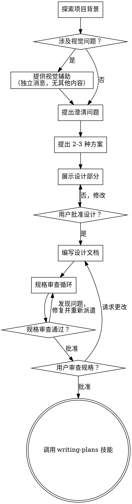

# 将想法头脑风暴成设计

通过自然的协作对话，帮助将想法转化为完整的设计和规格说明。

首先了解当前的项目背景，然后一次提出一个问题来完善想法。一旦理解了要构建的内容，就展示设计并获得用户批准。

<HARD-GATE>
在展示设计并获得用户批准之前，不要调用任何实现技能、编写任何代码、搭建任何项目或采取任何实现行动。这适用于每个项目，无论其看起来多么简单。
</HARD-GATE>

## 反模式："这太简单了，不需要设计"

每个项目都要经过这个过程。待办事项列表、单功能工具、配置更改——所有这些都要。"简单"的项目正是未经审视的假设造成最多浪费工作的地方。设计可以很简短（真正简单的项目只需几句话），但你必须展示它并获得批准。

## 检查清单

你必须为以下每个项目创建任务并按顺序完成：

1. **探索项目背景** — 检查文件、文档、最近的提交
2. **提供视觉辅助**（如果主题涉及视觉问题）— 这是一条独立的消息，不与澄清问题合并。参见下面的视觉辅助部分。
3. **提出澄清问题** — 一次一个，理解目的/约束/成功标准
4. **提出 2-3 种方案** — 附带权衡和你的推荐
5. **展示设计** — 按复杂度分部分展示，每部分后获得用户批准
6. **编写设计文档** — 保存到 `docs/superpowers/specs/YYYY-MM-DD-<topic>-design.md` 并提交
7. **规格审查循环** — 派遣 spec-document-reviewer 子代理，附带精确构建的审查上下文（不是你的会话历史）；修复问题并重新派遣直到批准（最多 5 次迭代，然后上报给人类）
8. **用户审查书面规格** — 要求用户在继续之前审查规格文件
9. **过渡到实现** — 调用 writing-plans 技能创建实现计划

## 流程图

**终端状态是调用 writing-plans。** 不要调用 frontend-design、mcp-builder 或任何其他实现技能。头脑风暴后唯一调用的技能是 writing-plans。

## 流程

**理解想法：**

- 首先查看当前项目状态（文件、文档、最近的提交）
- 在提出详细问题之前，评估范围：如果请求描述了多个独立的子系统（例如，"构建一个包含聊天、文件存储、计费和分析的平台"），立即标记这一点。不要花时间完善需要首先分解的项目细节。
- 如果项目对于单个规格来说太大，帮助用户分解为子项目：有哪些独立的模块，它们如何关联，应该按什么顺序构建？然后通过正常的设计流程头脑风暴第一个子项目。每个子项目都有自己的规格 → 计划 → 实现周期。
- 对于适当规模的项目，一次提出一个问题来完善想法
- 尽可能使用选择题，但开放式问题也可以
- 每个消息只提一个问题 —— 如果一个主题需要更多探索，将其分解为多个问题
- 专注于理解：目的、约束、成功标准

**探索方案：**

- 提出 2-3 种不同的方案及其权衡
- 以对话方式展示选项，附上你的推荐和理由
- 首先展示你的推荐选项并解释原因

**展示设计：**

- 一旦你认为理解了要构建的内容，就展示设计
- 根据每个部分的复杂度调整篇幅：简单的用几句话，复杂的用 200-300 字
- 每部分后询问是否看起来正确
- 涵盖：架构、组件、数据流、错误处理、测试
- 如有不符之处，准备好返回并澄清

**设计隔离性和清晰性：**

- 将系统分解为更小的单元，每个单元有一个明确的目的，通过定义良好的接口通信，可以独立理解和测试
- 对于每个单元，你应该能够回答：它做什么，如何使用它，它依赖什么？
- 有人能在不阅读内部实现的情况下理解一个单元的作用吗？你能在不破坏消费者的情况下改变内部实现吗？如果不能，边界需要调整。
- 更小、边界清晰的单元对你也更容易处理 —— 你能更好地理解一次能放在上下文中的代码，当文件聚焦时你的编辑更可靠。当一个文件变大时，这通常是它做了太多事情的信号。

**在现有代码库中工作：**

- 在提出更改之前探索当前结构。遵循现有模式。
- 如果现有代码有问题影响工作（例如，文件过大、边界不清晰、职责纠缠），将针对性改进作为设计的一部分 —— 就像优秀开发者改进他们正在工作的代码一样。
- 不要提议无关的重构。专注于服务当前目标的内容。

## 设计之后

**文档：**

- 将经过验证的设计（规格）写入 `docs/superpowers/specs/YYYY-MM-DD-<topic>-design.md`
  - （用户对规格位置的偏好覆盖此默认设置）
- 如果可用，使用 elements-of-style:writing-clearly-and-concisely 技能
- 将设计文档提交到 git

**规格审查循环：**
编写规格文档后：

1. 派遣 spec-document-reviewer 子代理（参见 spec-document-reviewer-prompt.md）
2. 如果发现问题：修复、重新派遣，重复直到批准
3. 如果循环超过 5 次迭代，上报给人类寻求指导

**用户审查关卡：**
规格审查循环通过后，要求用户在继续之前审查书面规格：

> "规格已编写并提交到 `<path>`。请在开始编写实现计划之前审查它，如果需要任何更改请告诉我。"

等待用户的回复。如果他们请求更改，进行修改并重新运行规格审查循环。只有在用户批准后才能继续。

**实现：**

- 调用 writing-plans 技能创建详细的实现计划
- 不要调用任何其他技能。writing-plans 是下一步。

## 关键原则

- **一次一个问题** —— 不要用过多个问题压倒用户
- **优先选择题** —— 比开放式问题更容易回答
- **严格执行 YAGNI** —— 从所有设计中移除不必要的功能
- **探索替代方案** —— 在确定之前总是提出 2-3 种方案
- **增量验证** —— 展示设计，在继续之前获得批准
- **保持灵活** —— 当某些内容不合理时返回并澄清

## 视觉辅助

一个基于浏览器的辅助工具，用于在头脑风暴期间展示模型、图表和视觉选项。作为工具可用 —— 不是模式。接受辅助意味着它可用于受益于视觉处理的问题；并不意味着每个问题都通过浏览器进行。

**提供辅助：** 当你预期即将到来的问题将涉及视觉内容（模型、布局、图表）时，一次性征求同意：
> "我们正在做的一些内容，如果我能在网页浏览器中展示给你可能会更容易解释。我可以在进行时组合模型、图表、比较和其他视觉内容。这个功能还比较新，可能会消耗较多 token。想试试吗？（需要打开本地 URL）"

**这个提供必须是独立的消息。** 不要将其与澄清问题、上下文摘要或任何其他内容合并。消息应只包含上述提供，别无其他。等待用户的回复后再继续。如果他们拒绝，继续仅使用文本的头脑风暴。

**每问题决策：** 即使用户接受后，也要为每个问题决定是否使用浏览器或终端。测试：**用户通过看到比阅读更能理解这个吗？**

- **使用浏览器** 用于视觉内容 —— 模型、线框、布局比较、架构图、并排视觉设计
- **使用终端** 用于文本内容 —— 需求问题、概念选择、权衡列表、A/B/C/D 文本选项、范围决策

关于 UI 主题的问题不自动成为视觉问题。"在这个上下文中个性意味着什么？"是概念问题 —— 使用终端。"哪个向导布局更好？"是视觉问题 —— 使用浏览器。

如果他们同意辅助，在继续之前阅读详细指南：
`skills/brainstorming/visual-companion.md`
