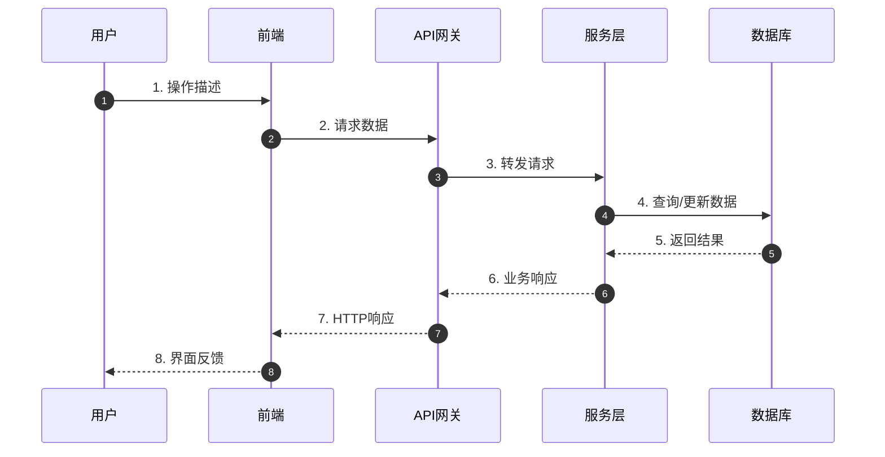

# 代码生成需求文档

根据项目代码自动生成结构化的需求规格文档，包含完整的时序图、模块拆解和原子需求。

## 工作流程

### 第一步：代码扫描与分析

1. 识别项目类型和技术栈
   - 查看 package.json、requirements.txt、pom.xml 等配置文件
   - 识别前端框架（React、Vue、Angular 等）
   - 识别后端框架（Spring Boot、Django、Express 等）
   - 识别数据库和中间件

2. 扫描项目结构
   - 使用 Glob 查找主要源码目录（src/、app/、pages/ 等）
   - 识别路由配置（分析页面结构）
   - 识别 API 接口定义（控制器、服务层、路由文件）
   - 识别数据模型（实体、DTO、Schema）

3. 读取关键文件
   - 入口文件（main.js、app.py 等）
   - 路由配置文件
   - 控制器/处理函数
   - 服务层/业务逻辑
   - 数据访问层

### 第二步：模块识别与拆解

基于代码分析结果，按功能维度拆解模块：

**模块识别原则：**
- 按业务领域划分（用户管理、订单系统、支付模块等）
- 按代码结构划分（如果业务边界不清晰）
- 每个模块应包含完整的业务闭环

**模块分析维度：**
- 模块名称和职责描述
- 包含的页面/组件（前端）
- 提供的接口/API
- 核心功能点
- 数据流转
- 与其他模块的依赖关系

### 第三步：时序图生成

为每个关键业务流程生成时序图：

**时序图绘制标准：**
- 使用 Mermaid 语法
- 涵盖完整的交互链条（用户 → 前端 → 后端 → 数据库/外部服务）
- 标注关键的数据转换和处理节点
- 包含异常处理流程（可选）

**必须绘制时序图的场景：**
- 用户核心操作流程（登录、下单、支付等）
- 跨模块的复杂交互
- 涉及多个服务的调用链
- 异步处理流程

### 第四步：原子需求提取

为每个模块提取原子需求：

**页面需求（前端）：**
- 页面名称和 URL
- 页面用途描述
- 包含的主要组件
- 输入/输出数据
- 关键交互点

**接口需求（后端）：**
- 接口路径和方法
- 请求参数和类型
- 响应数据结构
- 业务规则说明
- 错误处理

**功能点清单：**
- 功能编号（如 USER-001）
- 功能名称
- 功能描述
- 前置条件
- 后置条件
- 业务规则

**交互说明：**
- 用户操作流程
- 页面跳转逻辑
- 状态变化说明
- 反馈机制

### 第五步：文档生成

生成标准格式的需求文档：

```markdown
# [项目名称] 需求规格说明书

## 1. 项目概述
- 项目名称
- 技术栈
- 项目结构概览
- 模块列表

## 2. 全局时序图
系统核心业务流程的时序图（如用户注册登录流程）

## 3. 模块详细说明

### 3.1 [模块名称]

#### 模块概述
职责描述、与其他模块的关系

#### 时序图
模块内核心流程的时序图

#### 页面清单
| 页面名称 | URL | 描述 |
|---------|-----|------|
| ... | ... | ... |

#### 接口清单
| 接口名称 | 方法 | 路径 | 描述 |
|---------|------|------|------|
| ... | ... | ... | ... |

#### 功能点
| 编号 | 名称 | 描述 | 规则 |
|-----|------|------|------|
| ... | ... | ... | ... |

#### 交互说明
详细的用户交互流程

## 4. 数据模型
全局数据实体关系说明

## 5. 附录
- 术语表
- 变更记录
```

## 输出格式规范

### Mermaid 时序图标准



### 表格格式

所有表格使用标准 Markdown 表格格式，确保在各类文档工具中正确渲染。

## 执行检查点

在分析过程中，定期确认：
- [ ] 是否识别了所有主要模块？
- [ ] 是否覆盖了核心业务时序？
- [ ] 是否提取了所有接口信息？
- [ ] 是否包含异常流程说明？
- [ ] 文档结构是否清晰完整？

## 特殊处理

### 处理大型项目
- 优先分析核心业务模块
- 对非关键模块可做概要说明
- 提供模块导航和索引

### 处理模糊代码
- 基于命名和上下文推测功能
- 标注不确定性
- 建议代码优化方向

### 处理混合技术栈
- 分别识别各技术栈的组件
- 标注技术栈边界
- 说明跨技术栈的调用关系
