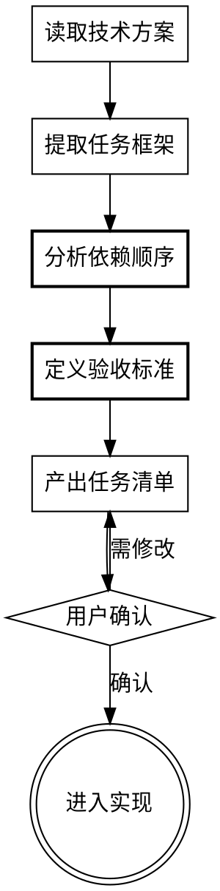

# 实施计划创建

将技术方案拆分为任务清单，通过链接引用已有文档。

<HARD-GATE>
技术方案必须已存在。实施计划不重复技术细节，只编排任务顺序。
</HARD-GATE>

## 核心输出：任务清单

实施计划文档包含：

| 章节 | 内容 | 目的 |
|------|------|------|
| **文档头部** | 目标、技术方案链接 | 定位和上下文 |
| **任务清单** | 任务列表+依赖+验收 | 执行路线图 |
| **里程碑** | 关键验收点 | 进度检查 |

## 工作流程



## 第一步：读取技术方案

从 `workplace/{版本}/tech-design/` 读取技术方案文档。

**检查**：若无技术方案，提示用户先完成技术方案设计。

## 第二步：提取任务框架

从技术方案的"实施计划"章节提取已有任务框架。

技术方案通常已包含：
- 阶段划分
- 任务列表（带预估时间）
- 依赖关系

**任务**：将这些内容整理为可执行的任务清单格式。

## 第三步：分析依赖顺序

确认任务执行顺序：

| 类型 | 处理 |
|------|------|
| **数据层任务** | 优先（无依赖） |
| **服务层任务** | 依赖数据层 |
| **接口层任务** | 依赖服务层 |
| **前端任务** | 依赖接口层 |

**输出**：依赖矩阵表

## 第四步：定义验收标准

每个任务关联验收标准，来源：
- 技术方案的测试策略章节
- 数据模型的约束定义
- API接口的成功标准

**验收格式**：
```markdown
**验收**：
- 测试：[测试命令] → [预期结果]
- 检查：[具体检查点]
- 参考：技术方案 §[章节号]
```

## 第五步：产出任务清单

### 文档命名

`workplace/{版本}/plan/YYYY-MM-DD-{项目名}-任务清单.md`

### 任务清单模板

```markdown
# {项目名} 任务清单

**目标**：[一句话说明]

**技术方案**：[技术方案文档路径链接]

---

## 任务清单

| 任务 | 内容 | 前置 | 验收标准 | 参考章节 |
|------|------|------|----------|----------|
| T1-1 | [任务描述] | 无 | [验收点] | §2.1 |
| T1-2 | [任务描述] | T1-1 | [验收点] | §2.2 |
| ... | ... | ... | ... | ... |

### 任务详情

#### T1-1: {任务名称}

**目标**：[一句话做什么]

**前置依赖**：无

**验收**：
- 测试：`pytest tests/xxx -v` → PASS
- 检查：数据库表创建成功
- 参考：[技术方案 §2.1 实体定义]

---

#### T1-2: {任务名称}

**目标**：[一句话做什么]

**前置依赖**：T1-1

**验收**：
- 测试：`pytest tests/xxx -v` → PASS
- 检查：迁移脚本执行成功
- 参考：[技术方案 §2.3 迁移计划]

---

## 里程碑

| 里程碑 | 验收点 | 包含任务 |
|--------|--------|----------|
| M1 | [验收描述] | T1-1, T1-2 |
| M2 | [验收描述] | T2-1, T2-2 |
| ... | ... | ... |

---

## 执行建议

推荐执行顺序：
1. T1-1 → T1-2（数据层）
2. T2-1 → T2-2 → T2-3（服务层）
3. T3-1 → T3-2 → T3-3（接口层）
4. T4-1 → T4-2（前端）

每完成一个任务立即执行验收测试。
```

## 第六步：用户确认

```
> 任务清单已完成，保存至 `<路径>`。请确认：
> - 任务顺序是否正确？
> - 验收标准是否可执行？
> - 参考链接是否准确？
```

---

## 设计原则

### 聚焦编排，不重复内容

任务清单只编排顺序和验收，技术细节通过链接指向技术方案。

### 保持一致性

任务描述引用技术方案章节号，确保不遗漏、不偏离。

### 验收可执行

每个任务有具体测试命令或检查点。

### 粒度适中

单个任务可在1-2小时完成。

---

## 特殊情况

### 任务过大

拆分为子任务，保持引用同一章节。

### 无测试命令

用"检查：[具体检查点]"替代，指明人工验收方式。

### 简单任务

直接产出精简清单，跳过里程碑。