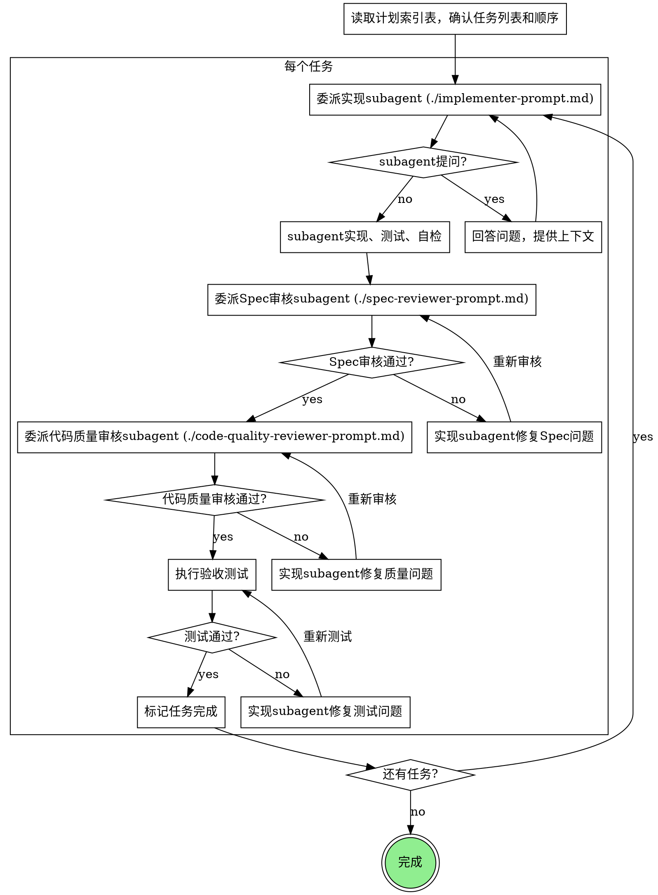

# 计划执行

按照实施计划逐个执行任务，通过subagent实现，两阶段审核确保质量。

<HARD-GATE>
实施计划必须已存在。无计划则先调用 implementation-planning skill。
计划文件路径：`workplace/v{N}/plan/` 目录下（版本格式为 v1、v2 等）。
</HARD-GATE>

## 为什么用Subagent

你把任务委托给有隔离上下文的专用agent。通过精确构建他们的指令和上下文，确保他们聚焦并成功完成任务。他们绝不继承你的会话上下文或历史——你构建他们确切需要的内容。这也保护你自己的上下文用于协调工作。

**核心原则**：每个任务用新subagent + 两阶段审核（先Spec后质量） = 高质量快速迭代

## 任务状态管理

任务状态以**任务清单文件中的状态列**为准，不依赖内存 TodoWrite（会话中断即丢失）。

| 时机 | 操作 |
|------|------|
| 开始执行某任务前 | 将该任务在文件中的状态改为 `执行中`，保存文件 |
| 任务通过所有审核后 | 将状态改为 `完成`，保存文件 |
| 会话中断后恢复 | 读取文件索引表，找第一个 `待执行` 或 `执行中` 任务继续 |

## 按需加载原则

**初始化时**：只读任务清单的"执行索引"部分（紧凑表格），获取任务数量和顺序，不加载详情。

**执行每个任务前**：通过标题跳转，只读该任务对应的"任务详情"章节，传给 subagent。

## 流程图



## 模型选择

用足够完成任务的最弱模型以节省成本和时间。

| 任务类型 | 推荐模型 |
|----------|----------|
| **机械实现**（1-2文件，清晰规范） | `claude-haiku-4-5` |
| **集成判断**（多文件，需要协调） | `claude-sonnet-4-6` |
| **架构设计审核** | `claude-opus-4-7` |

**复杂度信号**：
- 1-2文件有完整规范 → haiku
- 多文件有集成考虑 → sonnet
- 需要设计判断或广泛代码理解 → opus

## 禁止事项

**绝不**：
- 跳过Spec合规性审核或代码质量审核
- 在审核有问题时继续下一个任务
- 让subagent自检替代实际审核
- 在执行过程中提交git
- 并行委派多个实现subagent（会冲突）
- 让subagent自己读取计划文件（由你提取当前任务详情后传给subagent）
- 忽略subagent提问（回答后再继续）
- 在Spec合规性未通过时开始代码质量审核（错误顺序）
- 接受"差不多符合"Spec（审核发现问题=未完成）
- 在任一审核存在未解决问题时进入下一个任务

## Spec 审核依据

Spec审核器检查的是：**当前任务的实现是否符合任务清单中该任务的验收条目，以及验收条目引用的技术方案章节**。

审核时需传入：
1. 当前任务的验收标准（从任务详情章节提取）
2. 验收条目引用的技术方案章节链接/内容（按需读取对应章节，不加载整份技术方案）

审核通过的标准：验收条目全部满足，且未出现超出任务范围的额外实现。

## 提示词模板

- `references/implementer-prompt.md` - 委派实现subagent
- `references/spec-reviewer-prompt.md` - 委派Spec合规性审核subagent
- `references/code-quality-reviewer-prompt.md` - 委派代码质量审核subagent

## 示例工作流

```
你：我正在执行计划执行流程。

[读取任务清单.md 的"执行索引"表格，确认共5个任务及顺序]
[找到第一个"待执行"任务：T1-1 数据库迁移脚本]
[将 T1-1 状态改为"执行中"，保存文件]

[读取"任务详情 - T1-1"章节内容]
[委派实现subagent，使用 references/implementer-prompt.md，传入T1-1详情]

实现者："开始前 - hook应该安装在用户级还是系统级？"

你："用户级 (~/.config/superpowers/hooks/)"

实现者："明白。开始实现..."
[稍后] 实现者报告：
  - 实现了install-hook命令
  - 添加了测试，5/5通过
  - 自检：发现遗漏--force flag，已添加
  - 未提交git

[委派Spec合规性审核subagent，使用 references/spec-reviewer-prompt.md]
Spec审核者：✅ Spec合规 - 所有要求满足，无多余内容

[委派代码质量审核subagent，使用 references/code-quality-reviewer-prompt.md]
代码审核者：优点：测试覆盖好，干净。问题：无。Approved。

[执行验收测试]
测试通过。

[将 T1-1 状态改为"完成"，保存文件]

任务2：恢复模式

[读取"任务详情 - T1-2"章节内容]
[将 T1-2 状态改为"执行中"，保存文件]
[委派实现subagent]

实现者：[无问题，开始工作]
实现者报告：
  - 添加了verify/repair模式
  - 8/8测试通过
  - 自检：良好
  - 未提交git

[委派Spec审核]
Spec审核者：❌ 问题：
  - 缺失：进度报告（规范说"每100项报告一次"）
  - 多余：添加了--json flag（未请求）

[实现者修复问题]
实现者：移除--json flag，添加进度报告

[Spec审核者重新审核]
Spec审核者：✅ 现在Spec合规

[委派代码质量审核]
代码审核者：优点：扎实。问题（Important）：魔数(100)

[实现者修复]
实现者：提取PROGRESS_INTERVAL常量

[代码审核者重新审核]
代码审核者：✅ Approved

[执行验收测试]
测试通过。

[将 T1-2 状态改为"完成"，保存文件]

...

[所有任务状态均为"完成"]
[通知用户：全部任务已完成，可以进行 git 提交]

完成！
```

## 优势

**对比手动执行**：
- Subagent自然遵循TDD
- 每任务新上下文（无混淆）
- 并行安全（subagent不冲突）
- Subagent可提问（工作前和工作中）

**质量门槛**：
- 自检在交接前发现问题
- 两阶段审核：先Spec合规，后代码质量
- 审核循环确保修复实际工作
- Spec合规防止过度/不足构建
- 代码质量确保实现构建良好

**成本**：
- 更多subagent调用（每任务：实现者 + 2审核者）
- 控制器做更多准备（提前提取所有任务）
- 审核循环增加迭代
- 但早期发现问题（比后期调试更便宜）

## 与其他Skill的衔接

| Skill | 关系 |
|-------|------|
| **implementation-planning** | 创建此skill执行的计划 |
| **tech-design** | 计划引用的技术方案来源 |
| **requirements-workshop** | 技术方案引用的需求来源 |