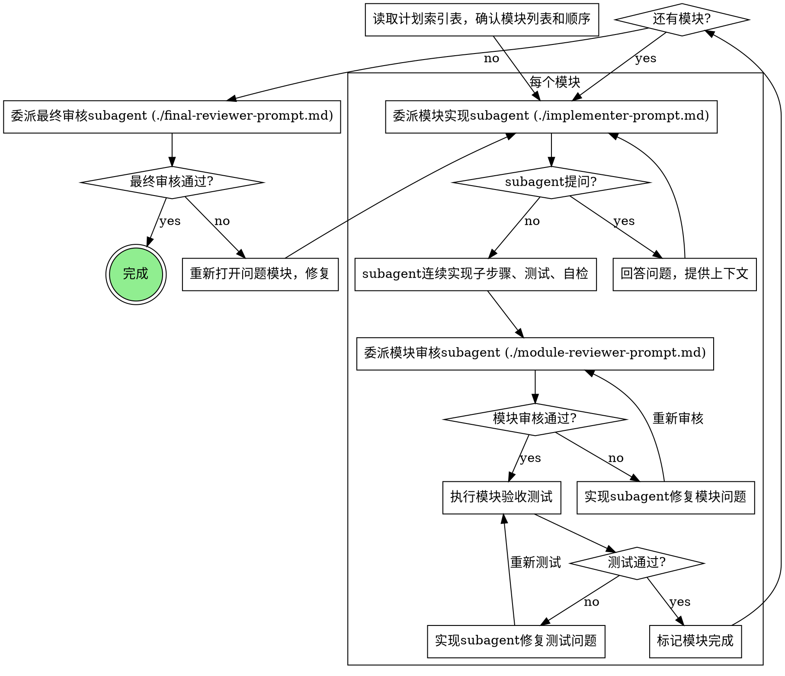

---
name: plan-execution
description: |
  执行实施计划的skill。按照模块清单逐个执行（含前后端模块），每个模块委托subagent连续实现子步骤，
  模块边界做单阶段审核，最终做E2E验收。所有测试文件统一放到 workplace/1.X/test/。
  执行过程中不提交git。触发词：执行计划、开始实施、按照计划执行、开始开发。
---

# 计划执行

按照实施计划逐个执行模块，通过subagent连续实现模块内子步骤，模块边界审核确保质量。

<HARD-GATE>
- 实施计划必须已存在。无计划则先调用 implementation-planning skill。
- 计划文件路径：`workplace/1.X/plan/` 目录下（X 为当前活跃版本数字，例如 `workplace/1/plan/`）。
- **所有新增测试文件必须落到 `workplace/1.X/test/` 下对应子目录**（backend/unit、backend/integration、frontend/unit、frontend/component、e2e、fixtures），不得放在源码旁。
- 执行过程中**不提交 git**。
</HARD-GATE>

## 版本号约定

`1.X` 为占位符。开始执行前先确认当前活跃版本号（查看 workplace/ 子目录），后续所有路径替换为该数字。详细规则见 `requirements-workshop/SKILL.md`。

## 测试目录规范（强制）

```
workplace/1.X/test/
├── backend/
│   ├── unit/<module>/         # 后端单元测试
│   └── integration/<module>/  # 后端集成测试
├── frontend/
│   ├── unit/<page-or-store>/  # 前端单元测试
│   └── component/<component>/ # 前端组件测试
├── e2e/<flow>.spec.ts         # 端到端测试
├── fixtures/                  # 共享测试数据
└── README.md                  # 运行命令矩阵 + 覆盖率目标
```

委派 implementer subagent 时，必须把"测试文件应落入的具体子目录"写进 prompt。
模块审核 subagent 必须检查测试文件位置合规。

如果 `workplace/1.X/test/` 不存在，第一个被执行的模块负责创建该骨架（含 README.md）。

## 为什么用Subagent

你把模块委托给有隔离上下文的专用agent。通过精确构建他们的指令和上下文，确保他们聚焦并成功完成模块。他们绝不继承你的会话上下文或历史——你构建他们确切需要的内容。这也保护你自己的上下文用于协调工作。

**核心原则**：每个模块用新subagent + 连续实现 + 边界审核 = 高质量高效迭代

## 模块状态管理

模块状态以**计划文件中的状态列**为准，不依赖内存 TodoWrite（会话中断即丢失）。

| 时机 | 操作 |
|------|------|
| 开始执行某模块前 | 将该模块在文件中的状态改为 `执行中`，保存文件 |
| 模块通过审核后 | 将状态改为 `完成`，保存文件 |
| 用户决定不做某模块 | 改为 `跳过`，并在该模块章节末尾追加"跳过原因"与"受影响下游模块"；若下游模块依赖被跳过模块的输出，必须先与用户确认替代方案再继续 |
| 会话中断后恢复 | 读取文件索引表，找第一个 `待执行` 或 `执行中` 模块继续；遇到 `跳过` 状态直接越过，但需检查下游依赖是否仍可执行 |

## 按需加载原则

**初始化时**：只读计划文件的"执行索引"部分（紧凑表格），获取模块数量和顺序，不加载详情。

**执行每个模块前**：通过标题跳转，只读该模块对应的"模块详情"章节，传给 subagent。

## 流程图



## 模型选择

用足够完成模块的最弱模型以节省成本和时间。

| 模块类型 | 推荐模型 |
|----------|----------|
| **机械实现**（模块内主要是重复性工作） | 最快最便宜的可用模型 |
| **集成判断**（模块涉及多文件协调） | 标准模型 |
| **模块审核** | 最强可用模型（需要判断力） |
| **最终E2E验收** | 标准模型 |

**复杂度信号**：
- 模块内主要是CRUD或重复模式 → 最快模型
- 模块涉及业务逻辑和接口设计 → 标准模型
- 模块审核（判断合规+质量） → 最强模型

## 禁止事项

**绝不**：
- 跳过模块审核（Spec合规+代码质量+测试目录合并为一次审核）
- 在审核有问题时继续下一个模块
- 让subagent自检替代实际审核
- 在执行过程中提交git
- 并行委派多个实现subagent（会冲突）
- 让subagent自己读取计划文件（由你提取当前模块详情后传给subagent）
- 忽略subagent提问（回答后再继续）
- 在模块审核未通过时标记完成
- 接受"差不多符合"（审核发现问题=未完成）
- 在任一审核存在未解决问题时进入下一个模块
- 把测试文件放在源码目录里（必须在 `workplace/1.X/test/` 下）
- 在没有为前端模块准备前端测试（单元/组件/E2E 至少一项）的情况下声明前端模块完成

## 模块审核依据

模块审核器检查的是：**当前模块的实现是否符合模块详情中的验收标准，以及模块引用的技术方案章节**。

审核聚焦：
1. **Spec合规**：是否实现了模块要求的所有子步骤？有无遗漏或超出范围？
2. **代码质量**：关键接口是否清晰？是否有明显质量问题？（不逐行审查，聚焦架构）
3. **模块边界**：对外接口是否与上下模块匹配？数据格式是否一致？
4. **测试目录合规**：新增测试文件是否全部位于 `workplace/1.X/test/` 下对应子目录？源码旁是否残留测试文件？前端模块是否含至少一类前端测试？

审核时需传入：
1. 当前模块的验收标准（从模块详情章节提取）
2. 模块引用的技术方案章节链接/内容（按需读取对应章节，不加载整份技术方案）
3. 相邻模块的接口契约（用于边界检查）
4. 测试目录规范（见前文"测试目录规范"章节）

审核通过的标准：模块验收条目满足，接口契约匹配，无严重质量问题，测试文件位置合规。

## 测试失败修复流程

如果模块级测试失败，按以下流程处理（不直接走重新审核）：

1. 主控 agent **不修改代码**，把失败摘要（命令、失败用例、错误日志）反馈给同一实现 subagent
2. 委派该实现 subagent 仅修复测试失败相关的代码与测试
3. 修复完成后**再次**运行模块测试命令
4. 如果三次仍未通过，停止并向用户报告：当前模块情况、已尝试的修复、推测的根因——由用户决定继续修、跳过还是回到设计阶段
5. 测试通过后，无需重新做模块审核（除非修复涉及到接口/架构变更，由主控 agent 判断）

## 提示词模板

- `references/implementer-prompt.md` - 委派模块实现subagent（传入模块内所有子步骤）
- `references/module-reviewer-prompt.md` - 委派模块审核subagent（合并Spec+质量+边界）
- `references/final-reviewer-prompt.md` - 委派最终审核subagent（所有模块完成后）

## 示例工作流

```
你：我正在执行计划执行流程。

[读取计划.md 的"执行索引"表格，确认共5个模块及顺序]

模块1：POC+基础设施

[读取"模块详情 - M1"章节内容]
[将 M1 状态改为"执行中"，保存文件]
[委派模块实现subagent，使用 references/implementer-prompt.md，传入M1详情]

实现者："开始前 - Agent流式输出的回调格式应该是什么样的？"

你："使用 LangChain 的 Streaming Callback 格式，见技术方案 §7.1"

实现者："明白。开始实现..."
[稍后] 实现者报告：
  - 子步骤1：安装依赖完成，requirements.txt已更新
  - 子步骤2：POC流式输出完成，测试通过
  - 子步骤3：useChat回归完成，测试通过
  - 自检：发现遗漏了环境变量模板，已添加
  - 未提交git

[委派模块审核subagent，使用 references/module-reviewer-prompt.md]
审核者：
  - Spec合规：✅ 3个子步骤全部完成
  - 代码质量：✅ 无明显问题
  - 模块边界：✅ 接口符合契约
  结论：通过

[执行模块验收测试]
测试通过。

[将 M1 状态改为"完成"，保存文件]

模块2：数据层

[读取"模块详情 - M2"章节内容]
[将 M2 状态改为"执行中"，保存文件]
[委派模块实现subagent]

实现者：[无问题，开始工作]
实现者报告：
  - 子步骤1：4张表迁移完成
  - 子步骤2：Repository+CAS实现完成
  - 自检：良好
  - 未提交git

[委派模块审核]
审核者：✅ 模块通过

[执行模块验收测试]
测试通过。

[将 M2 状态改为"完成"，保存文件]

...

[所有模块状态均为"完成"]
[读取需求文档验收标准 + 计划索引表]
[执行最终E2E测试]
[委派最终审核subagent，使用 references/final-reviewer-prompt.md]

最终审核者：✅ 所有验收标准满足，集成无问题，可以提交

完成！
```

## 优势

**对比逐任务执行**：
- 模块内上下文连续，减少切换开销
- 审核次数减少约70%（15任务×3审核 → 5模块×2审核）
- Subagent自然遵循TDD（模块级）
- 每模块新上下文（无混淆）
- 并行安全（subagent不冲突）
- Subagent可提问（工作前和工作中）

**质量门槛**：
- 自检在交接前发现问题
- 模块审核：一次审核覆盖合规+质量+边界
- 审核循环确保修复实际工作
- 模块审核防止过度/不足构建
- 最终E2E把关全局质量

**成本**：
- 更少subagent调用（每模块：实现者 + 1审核者）
- 控制器做更多准备（提前提取所有模块）
- 审核循环减少（模块数少）
- 早期发现问题（比后期调试更便宜）

## 与其他Skill的衔接

| Skill | 关系 |
|-------|------|
| **implementation-planning** | 创建此skill执行的模块计划 |
| **tech-design** | 模块引用的技术方案来源（含前端设计章节） |
| **requirements-workshop** | 技术方案引用的需求来源（含页面清单） |
| **test-suite-maintainer**（如有） | 后续可基于 `workplace/1.X/test/` 做测试整理与维护 |
