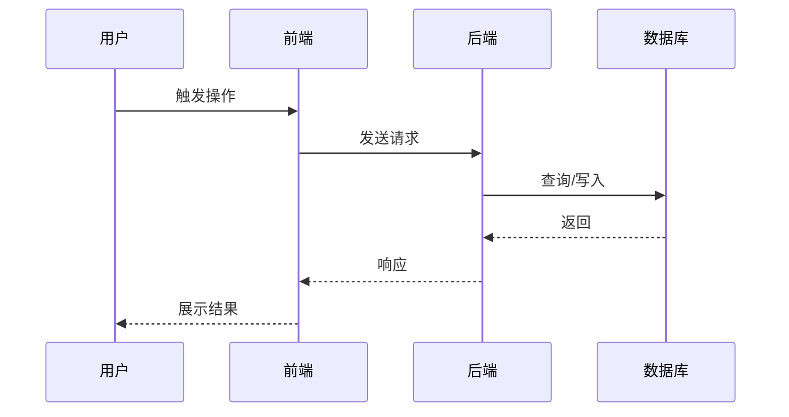

# 需求讨论与完善

将用户想法快速转化为完整需求文档，强调 MVP、架构先行、功能闭环、前后端一体。

<HARD-GATE>
未产出并经用户确认需求文档之前，不要进入实现阶段：不要写代码、不要建项目结构、不要调用下游skill。
</HARD-GATE>

## 版本号约定（贯穿本套4个skill）

文中 `1.X` 是工作版本目录占位符，X 为整数。
- 首次启动：`workplace/1/`；大版本迭代新建 `workplace/2/`，旧版本归档
- 同一版本内的需求、技术方案、计划、测试代码共享同一 X
- **写文件、跑命令时必须把 `1.X` 替换为实际数字**，不要在真实路径里保留 `1.X` 字面量

执行前先扫描 `workplace/` 已有子目录确认当前版本号。

## 核心原则：前后端联合考虑 + 架构先行

任何用户感知的功能都必须配套：**用户入口**（页面/按钮）、**界面反馈**（成功/失败/加载/空/异常态）、**数据展示**（结果 UI 形态）。

仅讨论后端逻辑会导致前端模块在后续阶段缺失。本 skill 在功能清单与页面清单两层强制覆盖前端。

**中大型需求必须先做架构设计再拆功能**——没有架构框架的功能清单是一盘散沙，功能间缺乏内聚，扩展时互相牵扯。架构设计为功能清单提供模块边界和依赖约束，也为后续 `tech-design` 提供业务层面的架构输入。

> 本步骤聚焦**业务/领域架构**（模块边界、领域模型、业务交互），不涉及技术实现细节（API设计、数据库表、服务拆分），后者由 `tech-design` skill 负责。

## 文档结构（核心输出）

| 章节 | 内容 | 检验 |
|------|------|------|
| 价值与可行性 | 用户痛点、不做的后果、技术/资源/兼容可行性 | 能说出具体用户和具体痛点 |
| 架构设计 | 现有架构概览、模块设计、领域模型、架构决策、演进路径 | 中大型需求必填；小需求可标注"不适用" |
| 功能清单 | 每个功能的描述、用户入口、输入输出、闭环 | 每个功能能自我闭环且有界面入口；按模块组织 |
| 页面/界面清单 | 所有页面、路由、状态、对应功能 | 前端可据此明确实现范围 |
| 时序图 | 业务流程与数据流转（含前端） | 完整用户旅程可视化 |
| 验收标准 | 验证方法与成功指标（含前端可见性） | 有可执行的验证步骤 |

## 工作流程（6 步）

1. **理解需求**（一次性问清场景、用户、痛点、期望、价值与可行性）
2. **架构分析与设计**（中大型需求必做；小需求跳过）
3. **梳理功能清单**（每个功能含用户入口与闭环，按模块组织）
4. **梳理页面清单 + 时序图**
5. **产出文档 + 自检 + 用户确认**
6. 确认后 → 进入 `tech-design`

**架构步骤触发条件**：满足以下任一条件时，第2步不可跳过——
- 涉及新模块或新子系统
- 需要修改现有数据模型
- 涉及跨模块交互（3个以上模块）
- 影响范围超过3个功能点
- 用户提到"系统""架构""扩展""重构"等词

小需求（单页面CRUD、纯UI调整、单接口新增）跳过第2步，功能清单中标注"本需求不涉及架构调整"即可。

---

## 第一步：理解需求（合并背景/价值/可行性）

先快速扫描项目结构与已有相关文档，再按下列要点**一组问完**（不需逐题等待，可在同一轮中给出 3-5 个问题）：

**场景与用户**
- 什么场景下想到要做这个？目标用户是谁？现状怎么解决，有什么不满？

**价值判断**
- 不做会怎样？现有方案为什么不够？这是雪中送炭还是锦上添花？

**可行性**
- 技术：现有技术栈能否支持？是否需要引入新技术或外部服务？
- 资源：预估投入？外部依赖？
- 兼容：是否会改动现有数据模型 / 与已有功能冲突？

价值分级：
- **核心价值**（影响主任务）→ 优先级高
- **效率价值**（提升效率）→ 视资源决定
- **体验价值**（美观/便利）→ 低优先级

**MVP 界定**：列子功能 → 分核心/辅助/优化 → MVP 只保留核心，能完成完整任务即可。

<PRINCIPLE>
用用户语言提问，避免技术术语。需求模糊时追问具体场景与具体用户，不要让用户用"可能/大概"。
</PRINCIPLE>

---

## 第二步：架构分析与设计（中大型需求必做）

这一步的核心目的：**在拆功能之前，先确定功能的"容器"——模块边界、依赖关系、数据流向**。没有这个框架，功能清单就是平铺的列表，功能之间缺少内聚，扩展时牵一发动全身。

### 2.1 现有架构扫描

扫描项目目录结构和已有代码/文档，识别：
- **模块划分**：现有业务模块有哪些，各自职责是什么
- **核心数据模型**：关键实体及其关系
- **模块间交互方式**：同步调用、事件驱动、共享数据等
- **设计约定**：命名规范、分层模式、错误处理方式等

输出要求：简要概览，不是完整架构文档。重点是让后续设计有据可依。

<PRINCIPLE>
如果项目中已有架构文档或模块说明，优先读取，避免重复梳理。扫描代码时关注目录结构和核心模型定义即可，不要深入实现细节。
</PRINCIPLE>

### 2.2 需求架构设计

基于现有架构和新需求，设计：

**模块设计**：
- 新增哪些模块，扩展哪些现有模块
- 每个模块的职责边界
- 模块间的依赖关系（谁调用谁、谁依赖谁的数据）

**领域模型**：
- 新增/修改的核心实体
- 实体间关系（一对一、一对多、聚合、组合）
- 关键状态流转

**架构决策**：
- 关键设计选择及其理由（如：为什么新建模块而非扩展现有模块）
- 被否决的替代方案及否决原因
- 与现有架构风格的取舍

**演进路径**：
- 预留的扩展点（哪些位置未来可能新增能力）
- 已知但本期不做的方向及原因

设计原则：
- **一致性**：与现有架构风格和约定保持一致
- **最小侵入**：优先扩展现有模块而非修改其内部逻辑
- **清晰边界**：每个模块有单一明确的职责，对外暴露有限的接口
- **可扩展**：为已知演进方向预留扩展点，但不为假设性需求过度设计
- **低耦合**：模块间通过明确契约交互，避免隐式依赖

### 2.3 架构验证

与用户一起确认：
- 新增模块与现有模块的边界是否合理
- 领域模型是否覆盖了需求中的所有场景
- 演进路径是否符合业务发展规划
- 是否存在循环依赖或过度耦合的风险

<PRINCIPLE>
架构验证不需要完美，只需要"够用且不埋坑"。重点确认方向正确，细节在后续步骤中完善。如果用户对架构没有强偏好，给出推荐方案并简述理由即可。
</PRINCIPLE>

---

## 第三步：梳理功能清单

每个功能用如下结构描述。**功能按第二步的模块分组**，同一模块的功能放在一起：

```markdown
### [模块名]

#### 功能N：[功能名]

**触发条件**：[使用场景]

**用户入口（前端）**：
- 页面/路由：[页面名 + 路由]
- 触发元素：[按钮/菜单/快捷键]
- 可见性：[何种角色/状态可见]

**输入**：[字段 + 界面元素（表单/选择器/上传）]

**处理逻辑**：[系统做什么]

**输出**：
- 业务结果：[数据/状态]
- 界面呈现：[列表/详情/弹窗/Toast]
- 加载/空/错误态：[各状态界面表现]

**闭环**：触发入口 → 操作路径 → 完成终点 → 结果反馈（成功/失败的具体界面）→ 异常处理
```

**闭环必检**：每个功能必须能回答"用户从哪里进入 / 怎么操作 / 看到什么完成 / 失败怎么提示"，缺一即不完整。

**跨模块功能标注**：如果一个功能涉及多个模块的协作，在功能描述中标注涉及的模块和交互方式。

---

## 第四步：页面清单 + 时序图

**页面/界面清单**（汇总所有功能的用户入口）：

| 页面/视图 | 路由 | 所属模块 | 主要功能 | 关键组件 | 状态（loading/空/错误/成功） | 权限 |
|----------|------|----------|----------|----------|------------------------------|------|
| 工单列表 | /tickets | 工单模块 | 功能1、功能3 | 列表、筛选、分页 | 加载中 / 无数据 / 加载失败 | 已登录 |

**校验**：功能清单中每个"用户入口"页面必须出现在本表；本表每个页面必须至少对应一个功能。

**时序图**（Mermaid sequenceDiagram）展示业务流程与前后端交互：



对于涉及多模块交互的流程，时序图中用不同 participant 区分各模块。

---

## 第五步：产出文档 + 自检 + 用户确认

**命名**：`YYYY-MM-DD-需求标题.md`
**位置**：`workplace/1.X/requirements/`（路径中 X 替换为实际数字）

### 文档模板

```markdown
# [需求名称]

## 一、价值与可行性

### 1.1 用户与痛点
- 目标用户：[角色]
- 触发场景：[场景]
- 现状痛点：[描述]
- 价值判断：[核心/效率/体验]

### 1.2 不做的后果
[损失/持续痛点]

### 1.3 与现有方案的差异
[新方案解决了什么]

### 1.4 可行性
- 技术：[方案/风险]
- 资源：[投入/依赖]
- 兼容：[与现有功能/数据关系]
- 结论：完全可行 / 条件可行 / 暂时不可行

## 二、架构设计

> 小需求可写"本需求不涉及架构调整"，跳过以下各节。

### 2.1 现有架构概览
[简要描述现有系统模块结构与核心数据模型]

### 2.2 模块设计
| 模块 | 职责 | 新增/扩展 | 依赖模块 | 扩展点 |
|------|------|-----------|----------|--------|

### 2.3 领域模型
[核心实体、关系、状态流转。可用 Mermaid classDiagram 或 ER 图]

### 2.4 架构决策与权衡
| 决策 | 选项 | 最终选择 | 理由 |
|------|------|----------|------|

### 2.5 演进路径
[未来可能扩展方向与本期预留设计]

## 三、功能清单
（按模块分组，按第三步结构描述每个功能）

## 四、页面/界面清单
（按第四步表格汇总）

## 五、时序图
（Mermaid sequenceDiagram）

## 六、验收标准

| 维度 | 验证方法 | 成功标准 |
|------|----------|----------|
| 功能正确（后端） | [接口/逻辑测试步骤] | [指标] |
| 功能正确（前端） | [界面操作步骤] | [可见性/交互正确] |
| 性能 | [测试方法] | [响应时间] |
| 架构一致性 | [模块边界/依赖验证] | [无循环依赖、边界清晰] |

## 七、附录

### 7.1 风险清单
[识别的风险与应对]

### 7.2 MVP 范围
- 必做：[核心功能]
- 选做：[辅助功能]
- 暂不做：[优化功能]
```

### 自检（一次 subagent 审查）

读取 `references/doc-reviewer-prompt.md`，将 `[SPEC_FILE_PATH]` 替换为实际路径后派发 subagent。

| 状态 | 处理 |
|------|------|
| 通过 | 进入用户确认 |
| 发现问题 | 修复后无需重审 |

### 用户确认

> 需求文档已完成，保存至 `<路径>`。请确认：
> - 价值判断是否准确？
> - 架构设计是否合理？模块边界是否清晰？
> - 功能清单是否完整、闭环？
> - 页面清单是否覆盖所有功能入口？
> - 验收标准是否可执行？

确认后宣布进入 `tech-design`。

---

## 工作原则

- **一组问完**：第一步把背景/价值/可行性合并问，避免来回拉锯
- **架构先行**：中大型需求先定架构再拆功能，避免功能碎片化
- **用用户语言**：避免技术术语
- **具体优于抽象**：追问具体场景、具体用户
- **YAGNI**：不添加用户未提到的功能
- **闭环必检**：每个功能都要能完成完整流程
- **前后端均覆盖**：功能清单+页面清单两层强制

## 特殊情况

- **需求过大**：建议拆分子项目，先选一个讨论
- **需求模糊**：要求用户举具体例子
- **价值不足**：明确告知属于体验价值，确认是否仍要做
- **不可行**：记录阻碍，讨论替代方案或推迟
- **架构分歧**：给出2-3个方案选项，列出各自优劣，让用户选择
- **架构与现有系统冲突**：明确标记冲突点，讨论是调整现有架构还是绕行，不要悄悄破坏一致性
