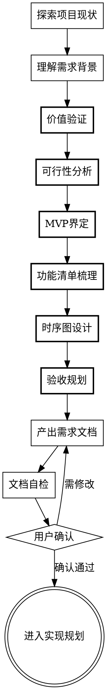
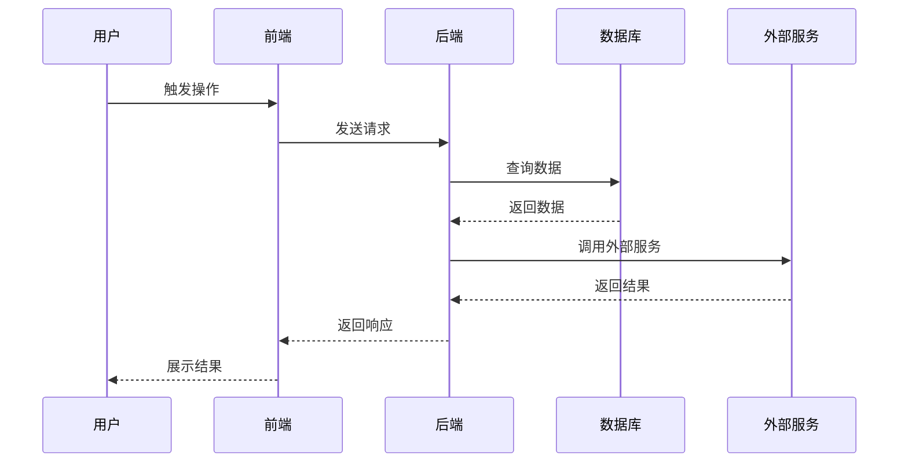

# 需求讨论与完善

通过结构化对话帮助用户将想法转化为完整需求文档。

<HARD-GATE>
在产出需求文档并获得用户确认之前，不要进入实现阶段。不要写代码、不要创建项目结构、不要调用实现类skill。
</HARD-GATE>

## 核心输出：需求文档结构

最终产出的需求文档必须包含：

| 章节 | 核心内容 | 检验标准 |
|------|----------|----------|
| **为什么要做** | 用户痛点、价值判断、不做的后果 | 能说出具体用户和具体痛点 |
| **能不能做** | 技术可行性、资源可行性、风险清单 | 有明确的可行性判断 |
| **功能清单** | 每个功能的描述、输入输出、闭环验证 | 每个功能都能自我闭环 |
| **时序图** | 业务流程、数据流转、系统交互 | 完整的用户旅程可视化 |
| **验收标准** | 验证方法、成功指标 | 有可执行的验证步骤 |

## 工作流程



## 第一步：探索项目现状

在讨论需求之前，先了解当前项目的状态：

- 查看项目结构、关键文件、最近提交
- 了解产品定位和已有功能
- 检查是否有相关的需求文档或设计文档

这确保需求讨论基于真实的产品现状。

## 第二步：理解需求背景

一次问一个问题，逐步深入理解：

**核心问题清单（按顺序探索）：**

1. **触发场景**：什么情况下想到要做这个？
2. **具体用户**：谁会遇到这个问题？能说出具体的人或角色吗？
3. **现状痛点**：现在他们是怎么解决的？有什么不满？
4. **期望结果**：如果有了这个功能，用户能做什么以前做不到的事？

<PRINCIPLE>
问问题时，不要用技术术语。问用户能感受到的问题，而不是实现细节。
</PRINCIPLE>

## 第三步：价值验证

使用"强制提问"检验需求是否值得做：

| 问题 | 检验目的 | 合格标准 |
|------|----------|----------|
| **不做会怎样？** | 检验必要性 | 能说出具体损失或持续痛点 |
| **用户愿意为此付出什么？** | 检验需求真实性 | 用户有明确的使用意愿 |
| **现有方案为什么不够？** | 检验差异化价值 | 能指出现有方案的明确缺陷 |
| **这是"锦上添花"还是"雪中送炭"？** | 检验优先级 | 能判断紧迫程度 |

**价值分级：**
- **核心价值**：不做会直接影响用户核心任务 → 优先级高
- **效率价值**：做了能提升效率，但不做用户也能完成任务 → 视资源决定
- **体验价值**：提升体验或美观 → 低优先级

## 第四步：可行性分析

从三个维度分析：

### 技术可行性
- 技术方案是否能实现？
- 现有技术栈能否支持？
- 有无需要引入新技术？
- 技术风险点？

### 资源可行性
- 需要多少开发时间？
- 有无依赖外部资源（API、数据、权限）？
- 团队是否有相关经验？

### 兼容可行性
- 与现有功能是否有冲突？
- 是否需要改动现有代码结构？
- 数据模型是否兼容？

**可行性结论：**
| 结论 | 后续动作 |
|------|----------|
| 完全可行 | 继续规划MVP |
| 条件可行 | 明确前置条件，评估风险接受度 |
| 暂时不可行 | 记录阻碍，讨论替代方案 |

## 第五步：MVP界定

MVP = 能验证价值的最小版本，必须能：
1. 完成核心用户任务
2. 形成完整的功能闭环
3. 能收集真实用户反馈

**界定方法：**
1. 列出所有子功能
2. 分类：核心功能 vs 辅助功能 vs 优化功能
3. 核心功能必做，辅助功能选做，优化功能暂不做
4. 检验：最小集合是否能完成核心用户任务？

## 第六步：功能清单梳理

每个功能需要定义清楚输入、输出和闭环验证。

### 功能清单格式

```markdown
## 功能清单

### 功能1：[功能名称]

**触发条件**：[什么情况下用户会使用这个功能]

**输入**：
- [用户需要提供什么信息/数据]

**处理逻辑**：
- [系统做什么处理]

**输出**：
- [用户得到什么结果/反馈]

**闭环验证**：
- 用户触发：[入口在哪里]
- 操作完成：[终点是什么]
- 结果可感知：[用户如何知道完成了]
- 异常处理：[失败时用户看到什么]
```

### 功能闭环检查清单

每个功能必须回答：
| 检查项 | 问题 |
|--------|------|
| 触发入口 | 用户从哪里进入这个功能？ |
| 操作路径 | 用户需要做什么操作？ |
| 完成终点 | 操作完成后用户看到什么？ |
| 结果反馈 | 成功/失败如何告知用户？ |
| 异常处理 | 出错时用户怎么办？ |

如果任一环节无法回答，说明功能闭环不完整，需要补充设计。

## 第七步：时序图设计

用可视化方式展示业务流程和数据流转。

### 时序图内容

时序图需要展示：
1. **业务流程**：用户操作的完整路径
2. **数据流转**：数据在各系统/模块间如何传递
3. **系统交互**：前端、后端、数据库、外部服务之间的调用关系

### 时序图格式

使用Mermaid语法：



## 第八步：验收规划

定义如何检验需求是否成功完成。

### 验收标准格式

```markdown
## 验收标准

| 维度 | 验证方法 | 成功标准 |
|------|----------|----------|
| 功能正确 | [测试步骤] | [具体指标] |
| 价值效果 | [反馈收集方式] | [期望变化] |
| 性能达标 | [性能测试方法] | [响应时间/并发指标] |
```

### 验收标准编写原则

- **具体可测量**：不用"体验好"，用"点击次数≤3"
- **有基线对比**：说明改进前是什么状态
- **分优先级**：核心功能必须达标，辅助功能可放宽

## 第九步：产出需求文档

将以上讨论整理为结构化需求文档。

### 文档命名与存储

**命名格式**：`YYYY-MM-DD-需求标题.md`

**存储位置**：`workplace/{版本}/requirements/`

示例：`workplace/1.0/requirements/2026-04-19-用户登录优化.md`

说明：
- workplace目录下只有一个当前版本目录（如1.0）
- 版本升级时创建新版本目录（如2.0），旧版本归档

### 需求文档模板

```markdown
# [需求名称]

## 一、为什么要做

### 用户与痛点
- **目标用户**：[具体用户角色]
- **触发场景**：[用户遇到问题的具体场景]
- **现状痛点**：[现在怎么解决，有什么不满]
- **价值判断**：[核心/效率/体验价值]

### 不做的后果
[如果不做，用户或产品会面临什么问题]

### 与现有方案的差异
[相比现有方案，新方案解决了什么问题]

## 二、能不能做

### 技术可行性
- **技术方案**：[概述实现方案]
- **技术栈兼容**：[现有技术栈是否支持]
- **技术风险**：[需要关注的风险点]

### 资源可行性
- **预估投入**：[开发时间/人力]
- **外部依赖**：[需要的API、数据、权限等]

### 兼容可行性
- **与现有功能关系**：[是否有冲突或依赖]
- **数据模型影响**：[是否需要改动数据结构]

### 可行性结论
[完全可行/条件可行/暂时不可行，说明原因]

## 三、功能清单

### 功能1：[功能名称]

**触发条件**：[用户使用场景]

**输入**：
- [用户提供的输入]

**处理逻辑**：
- [系统处理步骤]

**输出**：
- [返回给用户的结果]

**闭环验证**：
- 触发入口：[入口位置]
- 操作路径：[用户操作步骤]
- 完成终点：[终点状态]
- 结果反馈：[成功/失败反馈]
- 异常处理：[出错时的处理]

### 功能2：[功能名称]
...

## 四、时序图

### 业务流程时序图

```mermaid
sequenceDiagram
    [时序图内容]
```

### 数据流转说明

[数据在各系统间如何传递的说明]

## 五、验收标准

| 维度 | 验证方法 | 成功标准 |
|------|----------|----------|
| 功能正确 | [测试步骤] | [具体指标] |
| 价值效果 | [验证方式] | [期望变化] |
| 性能达标 | [测试方法] | [性能指标] |

### 验证计划
[具体的验证执行步骤]

## 六、附录

### 风险清单
[识别的风险点及应对思路]

### MVP范围说明
- **必做**：[核心功能列表]
- **选做**：[辅助功能列表]
- **暂不做**：[优化功能列表]

### 后续迭代方向
[MVP验证后的可能迭代方向]
```

## 第十步：文档自检（派发审查subagent）

产出文档后，派发独立subagent进行审查。

### 如何派发

1. 读取 `references/doc-reviewer-prompt.md`
2. 使用Agent工具，传入审查prompt（将 `[SPEC_FILE_PATH]` 替换为实际文档路径）

审查subagent是独立视角，不受主对话上下文影响，能发现遗漏的问题。

### 处理审查结果

| 状态 | 处理 |
|------|------|
| 通过 | 进入用户确认环节 |
| 发现问题 | 根据问题清单修复文档，修复后无需重新审查 |

## 第十一步：用户确认

产出并自检后，请用户确认：

> 需求文档已完成，保存至 `<路径>`。请确认：
> - 价值判断是否准确？
> - 功能清单是否完整？每个功能是否闭环？
> - 时序图是否清晰？
> - 验收标准是否可执行？

如需修改，调整后再次确认。确认后进入实现规划阶段。

---

## 工作原则

### 一问一答
每个问题单独提问，给用户思考空间。

### 用用户语言
避免技术术语，用用户能理解的概念。

### 具体优于抽象
追问具体场景、具体用户、具体痛点。

### 挑战假设
如果用户说"用户需要"，追问"哪个用户？什么场景？"

### YAGNI原则
不添加用户没提到的功能。

### 闭环必检
每个功能都要检验用户能否完成完整任务流程。

---

## 特殊情况处理

### 需求过大

如果需求涉及多个独立子系统，立即提示：

> 这个需求范围较大，建议拆分为多个子项目。我们先讨论哪个子系统？

帮助用户分解需求，每个子系统单独产出需求文档。

### 需求模糊

如果用户只说"我想做个XXX"没有具体场景：

> 什么情况下想到要做这个？能举个具体例子吗？

### 价值分歧

如果用户认为重要，分析发现价值较低：

> 根据分析，这个需求属于体验价值级别。建议先确认资源分配是否合理。

### 不可行需求

如果可行性分析发现阻碍：

1. 记录阻碍因素
2. 讨论替代方案
3. 或讨论推迟时机

> 目前发现XX因素导致暂时不可行。可能的替代方案是...或者等XX条件满足后再做。