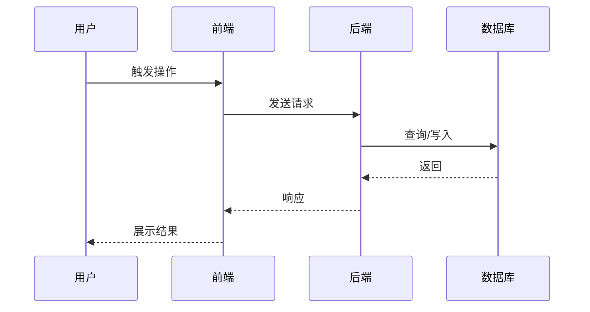

# 需求讨论与完善

将用户想法快速转化为完整需求文档，强调 MVP、功能闭环、前后端一体。

<HARD-GATE>
未产出并经用户确认需求文档之前，不要进入实现阶段：不要写代码、不要建项目结构、不要调用下游skill。
</HARD-GATE>

## 版本号约定（贯穿本套4个skill）

文中 `1.X` 是工作版本目录占位符，X 为整数。
- 首次启动：`workplace/1/`；大版本迭代新建 `workplace/2/`，旧版本归档
- 同一版本内的需求、技术方案、计划、测试代码共享同一 X
- **写文件、跑命令时必须把 `1.X` 替换为实际数字**，不要在真实路径里保留 `1.X` 字面量

执行前先扫描 `workplace/` 已有子目录确认当前版本号。

## 核心原则：前后端联合考虑

任何用户感知的功能都必须配套：**用户入口**（页面/按钮）、**界面反馈**（成功/失败/加载/空/异常态）、**数据展示**（结果 UI 形态）。

仅讨论后端逻辑会导致前端模块在后续阶段缺失。本 skill 在功能清单与页面清单两层强制覆盖前端。

## 文档结构（核心输出）

| 章节 | 内容 | 检验 |
|------|------|------|
| 价值与可行性 | 用户痛点、不做的后果、技术/资源/兼容可行性 | 能说出具体用户和具体痛点 |
| 功能清单 | 每个功能的描述、用户入口、输入输出、闭环 | 每个功能能自我闭环且有界面入口 |
| 页面/界面清单 | 所有页面、路由、状态、对应功能 | 前端可据此明确实现范围 |
| 时序图 | 业务流程与数据流转（含前端） | 完整用户旅程可视化 |
| 验收标准 | 验证方法与成功指标（含前端可见性） | 有可执行的验证步骤 |

## 工作流程（精简为 5 步）

1. **理解需求**（一次性问清场景、用户、痛点、期望、价值与可行性）
2. **梳理功能清单**（每个功能含用户入口与闭环）
3. **梳理页面清单 + 时序图**
4. **产出文档 + 自检 + 用户确认**
5. 确认后 → 进入 `tech-design`

---

## 第一步：理解需求（合并背景/价值/可行性）

先快速扫描项目结构与已有相关文档，再按下列要点**一组问完**（不需逐题等待，可在同一轮中给出 3-5 个问题）：

**场景与用户**
- 什么场景下想到要做这个？目标用户是谁？现状怎么解决，有什么不满？

**价值判断**
- 不做会怎样？现有方案为什么不够？这是雪中送炭还是锦上添花？

**可行性**
- 技术：现有技术栈能否支持？是否需要引入新技术或外部服务？
- 资源：预估投入？外部依赖？
- 兼容：是否会改动现有数据模型 / 与已有功能冲突？

价值分级：
- **核心价值**（影响主任务）→ 优先级高
- **效率价值**（提升效率）→ 视资源决定
- **体验价值**（美观/便利）→ 低优先级

**MVP 界定**：列子功能 → 分核心/辅助/优化 → MVP 只保留核心，能完成完整任务即可。

<PRINCIPLE>
用用户语言提问，避免技术术语。需求模糊时追问具体场景与具体用户，不要让用户用"可能/大概"。
</PRINCIPLE>

---

## 第二步：梳理功能清单

每个功能用如下结构描述：

```markdown
### 功能N：[功能名]

**触发条件**：[使用场景]

**用户入口（前端）**：
- 页面/路由：[页面名 + 路由]
- 触发元素：[按钮/菜单/快捷键]
- 可见性：[何种角色/状态可见]

**输入**：[字段 + 界面元素（表单/选择器/上传）]

**处理逻辑**：[系统做什么]

**输出**：
- 业务结果：[数据/状态]
- 界面呈现：[列表/详情/弹窗/Toast]
- 加载/空/错误态：[各状态界面表现]

**闭环**：触发入口 → 操作路径 → 完成终点 → 结果反馈（成功/失败的具体界面）→ 异常处理
```

**闭环必检**：每个功能必须能回答"用户从哪里进入 / 怎么操作 / 看到什么完成 / 失败怎么提示"，缺一即不完整。

---

## 第三步：页面清单 + 时序图

**页面/界面清单**（汇总所有功能的用户入口）：

| 页面/视图 | 路由 | 主要功能 | 关键组件 | 状态（loading/空/错误/成功） | 权限 |
|----------|------|----------|----------|------------------------------|------|
| 工单列表 | /tickets | 功能1、功能3 | 列表、筛选、分页 | 加载中 / 无数据 / 加载失败 | 已登录 |

**校验**：功能清单中每个"用户入口"页面必须出现在本表；本表每个页面必须至少对应一个功能。

**时序图**（Mermaid sequenceDiagram）展示业务流程与前后端交互：



---

## 第四步：产出文档 + 自检 + 用户确认

**命名**：`YYYY-MM-DD-需求标题.md`
**位置**：`workplace/1.X/requirements/`（路径中 X 替换为实际数字）

### 文档模板

```markdown
# [需求名称]

## 一、价值与可行性

### 1.1 用户与痛点
- 目标用户：[角色]
- 触发场景：[场景]
- 现状痛点：[描述]
- 价值判断：[核心/效率/体验]

### 1.2 不做的后果
[损失/持续痛点]

### 1.3 与现有方案的差异
[新方案解决了什么]

### 1.4 可行性
- 技术：[方案/风险]
- 资源：[投入/依赖]
- 兼容：[与现有功能/数据关系]
- 结论：完全可行 / 条件可行 / 暂时不可行

## 二、功能清单
（按第二步结构描述每个功能）

## 三、页面/界面清单
（按第三步表格汇总）

## 四、时序图
（Mermaid sequenceDiagram）

## 五、验收标准

| 维度 | 验证方法 | 成功标准 |
|------|----------|----------|
| 功能正确（后端） | [接口/逻辑测试步骤] | [指标] |
| 功能正确（前端） | [界面操作步骤] | [可见性/交互正确] |
| 性能 | [测试方法] | [响应时间] |

## 六、附录

### 6.1 风险清单
[识别的风险与应对]

### 6.2 MVP 范围
- 必做：[核心功能]
- 选做：[辅助功能]
- 暂不做：[优化功能]
```

### 自检（一次 subagent 审查）

读取 `references/doc-reviewer-prompt.md`，将 `[SPEC_FILE_PATH]` 替换为实际路径后派发 subagent。

| 状态 | 处理 |
|------|------|
| 通过 | 进入用户确认 |
| 发现问题 | 修复后无需重审 |

### 用户确认

> 需求文档已完成，保存至 `<路径>`。请确认：
> - 价值判断是否准确？
> - 功能清单是否完整、闭环？
> - 页面清单是否覆盖所有功能入口？
> - 验收标准是否可执行？

确认后宣布进入 `tech-design`。

---

## 工作原则

- **一组问完**：第一步把背景/价值/可行性合并问，避免来回拉锯
- **用用户语言**：避免技术术语
- **具体优于抽象**：追问具体场景、具体用户
- **YAGNI**：不添加用户未提到的功能
- **闭环必检**：每个功能都要能完成完整流程
- **前后端均覆盖**：功能清单+页面清单两层强制

## 特殊情况

- **需求过大**：建议拆分子项目，先选一个讨论
- **需求模糊**：要求用户举具体例子
- **价值不足**：明确告知属于体验价值，确认是否仍要做
- **不可行**：记录阻碍，讨论替代方案或推迟
