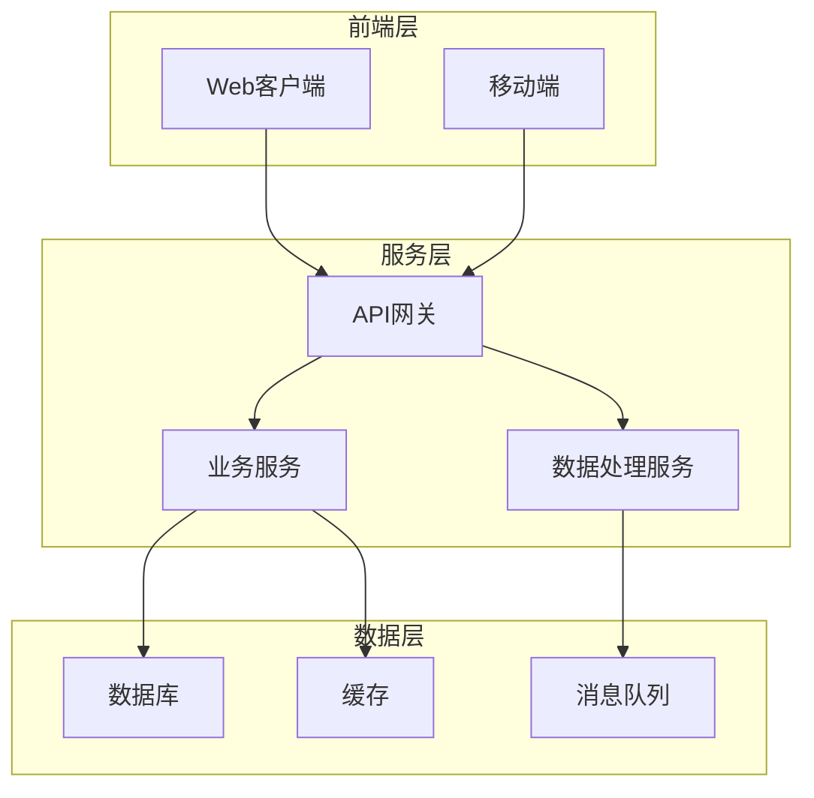

# 技术方案设计

基于需求文档产出完整技术方案。核心原则：**文档先行，方案后行**。

<HARD-GATE>
在技术文档准备完成并存入workplace/v{N}/references目录之前，不得开始技术方案设计。
不得写代码、不得创建项目结构、不得进入实现阶段。
</HARD-GATE>

## 工作流程

1. 读取需求文档
2. 识别功能清单，区分新旧功能
3. 讨论技术文档需求（关键前置步骤，用户确认后再继续）
4. 新功能：收集参考文档；旧功能扩展：整理技术栈说明
5. 文档存入 `workplace/v{N}/references/`
6. 架构设计 → 数据模型设计 → API 设计 → 测试策略
7. 产出技术方案文档
8. 文档自检（subagent 审查）
9. 用户确认 → 修改后循环，确认后提示进入 implementation-planning

## 第一步：读取需求文档

从workplace/v{N}/requirements/读取最近的需求文档。

**如果不存在需求文档**：
> 未找到需求文档。请先使用requirements-workshop产出需求文档，或直接提供需求文档路径。

**如果存在多个需求文档**：
列出最近3个，请用户选择。

## 第二步：识别功能清单

从需求文档中提取功能清单，明确每个功能：
- 功能名称和描述
- 输入/输出
- 处理逻辑
- 与其他功能的关系

## 第三步：区分新旧功能

对每个功能进行分类：

| 分类 | 定义 | 文档要求 |
|------|------|----------|
| **新功能** | 项目中不存在类似实现，需要引入新技术/新模块 | 必须有参考文档 |
| **旧功能扩展** | 基于现有代码扩展，改动现有模块 | 必须有技术栈说明文档 |
| **旧功能复用** | 直接调用现有功能，无改动 | 无需额外文档 |

### 判断方法

1. 搜索项目中是否存在相关代码
2. 检查现有技术栈是否支持
3. 询问用户确认分类

## 第四步：讨论技术文档需求（关键步骤）

这是核心前置步骤。**在产出文档需求清单并获得用户确认后，才能继续。**

### 输出格式

```markdown
## 技术文档需求清单

### 新功能（需要参考文档）

| 功能 | 参考文档类型 | 来源建议 | 状态 |
|------|-------------|----------|------|
| [功能名] | API文档/SDK文档/框架文档 | 官方文档/社区资源 | 待准备 |

### 旧功能扩展（需要技术栈说明）

| 功能 | 涉及模块 | 文档要求 | 状态 |
|------|----------|----------|------|
| [功能名] | [模块路径] | 现有代码结构、数据模型、接口说明 | 待整理 |

### 文档存放位置

所有文档存入：`workplace/v{N}/references/`

命名规则：
- 参考文档：`{技术名}-reference.md`
- 技术栈说明：`{模块名}-techstack.md`
```

### 确认问题

> 以上是技术文档需求清单。请确认：
> - 新功能的参考文档类型是否正确？
> - 旧功能涉及的模块是否完整？
> - 是否有其他技术文档需要准备？

**用户确认后，进入文档准备阶段。**

## 第五步：新功能参考文档准备

对于每个新功能，收集参考文档。

### 参考文档类型

| 类型 | 内容要求 | 收集方式 |
|------|----------|----------|
| **API文档** | 接口定义、请求/响应格式、错误码 | 官方文档链接或本地副本 |
| **SDK文档** | 安装方法、核心API、示例代码 | 官方文档或README |
| **框架文档** | 核心概念、使用方式、最佳实践 | 官方文档、教程 |
| **库文档** | API列表、配置选项、版本兼容 | npm/pyPI/GitHub |
| **算法文档** | 算法原理、参数说明、性能特性 | 论文、技术博客 |

### 文档内容模板

```markdown
# {技术名} 参考文档

## 基本信息
- 官方链接：[URL]
- 版本：[版本号]
- 引入方式：[npm install / pip install / ...]

## 核心概念
[关键技术概念说明]

## API参考
### [API名称]
- 用途：[说明]
- 参数：[参数列表]
- 返回：[返回格式]
- 示例：[代码示例]

## 最佳实践
[官方推荐的使用方式]

## 注意事项
[已知问题、性能限制、兼容性说明]

## 与本项目的关联
[本项目中如何使用该技术]
```

### 收集方式

1. **使用Context7 MCP**：搜索官方文档
2. **WebFetch/WebSearch**：获取在线文档
3. **用户提供**：用户已有的文档链接或本地文件
4. **代码探索**：从现有代码中提取使用模式

## 第六步：旧功能技术栈说明整理

对于旧功能扩展，整理现有代码的技术说明。

### 探索步骤

1. 搜索涉及模块的代码文件
2. 分析现有架构、数据模型、接口
3. 整理成技术栈说明文档

### 技术栈说明模板

```markdown
# {模块名} 技术栈说明

## 模块定位
[模块在系统中的角色和职责]

## 代码结构
- 主要文件：[文件列表及职责]
- 目录结构：[目录树]

## 数据模型
### [模型名称]
- 表名：[数据库表名]
- 字段：[字段列表及说明]
- 关系：[与其他模型的关系]

## API接口
### [接口名称]
- 路径：[URL路径]
- 方法：[HTTP方法]
- 参数：[参数列表]
- 返回：[返回格式]
- 调用方：[谁调用这个接口]

## 依赖关系
- 上游依赖：[依赖的其他模块]
- 下游服务：[被谁依赖]

## 扩展点
[当前可扩展的位置和方式]

## 注意事项
[改动时需要注意的问题]
```

## 第七步：文档存入references目录

将所有准备好的文档存入指定目录。

### 目录结构

```
workplace/
└── {版本}/  # 当前版本，如 1.0
    ├── requirements/  # 需求文档
    ├── references/    # 技术参考文档
    │   ├── {技术名}-reference.md      # 新功能参考文档
    │   └── {模块名}-techstack.md      # 旧功能技术栈说明
    └── tech-design/   # 技术方案文档（后续产出）
```

### 验证清单

在进入技术方案设计前，验证：

| 检查项 | 要求 |
|--------|------|
| 目录存在 | workplace/v{N}/references/ 已创建 |
| 新功能文档 | 每个新功能都有对应的参考文档 |
| 旧功能文档 | 每个旧功能扩展都有技术栈说明 |
| 文档质量 | 文档包含必要的技术细节，足以支撑设计 |

**验证通过后**，宣布：
> 技术文档准备完成，存入 workplace/v{N}/references/。开始技术方案设计。

## 第八步：架构设计

基于需求和参考文档，设计系统架构。

### 架构设计内容

| 章节 | 内容 |
|------|------|
| **系统架构图** | 模块划分、层次结构、依赖关系 |
| **技术选型** | 每个模块使用的技术栈及理由 |
| **部署架构** | 服务部署方式、网络拓扑 |
| **数据流向** | 数据在各模块间如何流转 |

### 架构图格式

使用Mermaid或ASCII：



## 第九步：数据模型设计

设计数据存储结构。

### 数据模型内容

| 章节 | 内容 |
|------|------|
| **实体定义** | 每个数据实体的字段、类型、约束 |
| **关系图** | 实体间的关系（一对一、一对多、多对多） |
| **索引设计** | 查询优化所需的索引 |
| **迁移计划** | 如果涉及现有数据，如何迁移 |

### 实体定义模板

```markdown
### {实体名称}

| 字段名 | 类型 | 必填 | 默认值 | 说明 |
|--------|------|------|--------|------|
| id | UUID | 是 | 自动生成 | 主键 |
| name | string(100) | 是 | - | 名称 |
| created_at | timestamp | 是 | 当前时间 | 创建时间 |
| ... | ... | ... | ... | ... |

**约束**：
- [约束说明]

**索引**：
- [索引字段]：用于[查询场景]
```

## 第十步：API设计

设计系统接口。

### API设计内容

| 章节 | 内容 |
|------|------|
| **接口清单** | 所有API的列表 |
| **接口详情** | 每个接口的完整定义 |
| **认证方式** | API如何认证 |
| **错误处理** | 错误码和错误响应格式 |

### 接口定义模板

```markdown
### {接口名称}

**路径**：`[HTTP方法] /api/v1/[路径]`

**描述**：[接口用途]

**认证**：[认证方式]

**请求参数**：

| 参数名 | 位置 | 类型 | 必填 | 说明 |
|--------|------|------|------|------|
| id | path | string | 是 | 资源ID |
| name | body | string | 是 | 名称 |

**请求示例**：
```json
{
  "name": "示例名称"
}
```

**响应格式**：

| 字段名 | 类型 | 说明 |
|--------|------|------|
| id | string | 资源ID |
| name | string | 名称 |

**响应示例**：
```json
{
  "id": "abc123",
  "name": "示例名称"
}
```

**错误码**：

| 错误码 | 说明 |
|--------|------|
| 400 | 参数错误 |
| 401 | 未认证 |
| 404 | 资源不存在 |
```

## 第十一步：测试策略

定义测试方案。

### 测试策略内容

| 章节 | 内容 |
|------|------|
| **测试范围** | 哪些功能需要测试 |
| **测试类型** | 单元测试、集成测试、E2E测试 |
| **测试环境** | 测试所需的配置和环境 |
| **测试数据** | 测试数据的准备方式 |
| **覆盖率目标** | 目标覆盖率 |

### 测试分类

| 类型 | 覆盖范围 | 工具建议 |
|------|----------|----------|
| **单元测试** | 核心业务逻辑、数据处理函数 | Jest/Vitest/pytest |
| **集成测试** | API接口、数据库操作 | Supertest/pytest |
| **E2E测试** | 用户关键路径 | Playwright/Cypress |

## 第十二步：产出技术方案文档

将以上内容整合为完整文档。

### 文档命名与存储

**命名格式**：`YYYY-MM-DD-{需求名称}-技术方案.md`

**存储位置**：`workplace/v{N}/tech-design/`

### 技术方案模板

```markdown
# {需求名称} 技术方案

> 需求文档：[需求文档路径]
> 技术参考：workplace/v{N}/references/

## 一、架构设计

### 1.1 系统架构图
[架构图]

### 1.2 技术选型
[技术选型说明]

### 1.3 部署架构
[部署说明]

## 二、数据模型设计

### 2.1 实体定义
[实体列表]

### 2.2 关系图
[ER图]

### 2.3 索引设计
[索引说明]

## 三、API设计

### 3.1 接口清单
[接口列表]

### 3.2 接口详情
[每个接口的详细定义]

## 四、测试策略

### 4.1 测试范围
[测试范围说明]

### 4.2 测试类型与工具
[测试分类]

### 4.3 覆盖率目标
[覆盖率指标]

## 五、风险评估

### 5.1 技术风险
[风险点及应对]

### 5.2 兼容风险
[与现有系统的兼容问题]

### 5.3 资源风险
[人力、时间风险]

## 六、附录

### 6.1 参考文档清单
[references目录中的文档列表]

### 6.2 术语表
[技术术语解释]
```

## 第十三步：文档自检（派发审查subagent）

产出文档后，派发独立subagent进行审查。

### 如何派发

1. 读取 `references/tech-design-reviewer-prompt.md`
2. 使用Agent工具，传入审查prompt（替换文档路径）

审查subagent是独立视角，不受主对话上下文影响。

### 处理审查结果

| 状态 | 处理 |
|------|------|
| 通过 | 进入用户确认环节 |
| 发现问题 | 根据问题清单修复，修复后无需重新审查 |

## 第十四步：用户确认

产出并自检后，请用户确认：

> 技术方案文档已完成，保存至 `<路径>`。请确认：
> - 架构设计是否合理？
> - 数据模型是否完整？
> - API设计是否满足需求？
> - 测试策略是否可行？
> - 风险评估是否覆盖主要问题？

如需修改，调整后再次确认。确认后提示用户进入下一步：

> 技术方案已确认。下一步：使用 `implementation-planning` skill 将技术方案拆分为带状态追踪的可执行任务清单。

---

## 工作原则

### 文档先行

技术文档准备完成前，不得进入设计阶段。这是硬性规则。

### 基于需求

技术方案必须完全覆盖需求文档的功能清单。

### 风险意识

每个设计决策都要考虑潜在风险和应对方案。

### 适度抽象

架构设计要平衡通用性和具体性，避免过度抽象或过度具体。

---

## 特殊情况处理

### 需求过大

如果技术方案涉及多个独立子系统：

> 这个方案范围较大，建议拆分为多个子方案。先设计哪个子系统？

### 技术选型分歧

如果多个技术方案各有优劣：

| 方案 | 优点 | 缺点 |
|------|------|------|
| 方案A | [优点] | [缺点] |
| 方案B | [优点] | [缺点] |

> 两种方案各有优劣。请选择或提出其他思路。

### 文档无法获取

如果某个参考文档无法获取：

> [功能]的参考文档无法获取。可选方案：
> 1. 用户手动提供文档
> 2. 探索现有代码推断使用方式
> 3. 推迟该功能的设计

### 现有代码复杂

如果旧功能涉及代码过于复杂，难以整理技术栈说明：

> [模块]的代码复杂度较高。建议：
> 1. 聚焦核心接口和数据模型，忽略实现细节
> 2. 分步骤探索：先接口层，再数据层，后业务层
> 3. 用户协助说明关键逻辑